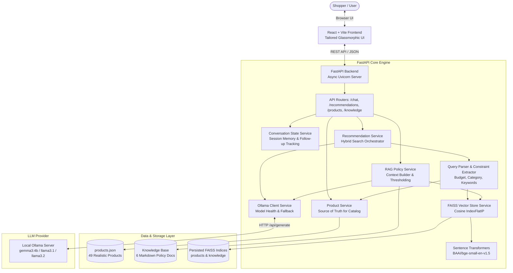

# ShopEase AI — AI E-Commerce Product Recommendation & Customer Support Assistant

A production-grade, AI-powered e-commerce assistant featuring **Retrieval-Augmented Generation (RAG)**, **hybrid deterministic & semantic vector search** with **FAISS**, local LLM inference via **Ollama (Gemma 3 4B / Llama 3.1)**, **Sentence-Transformers (BGE)**, and a **FastAPI** backend paired with a **React + Vite** frontend.

---

## 1. Project Overview

ShopEase AI bridges the gap between natural language user requests and e-commerce catalogs/policies. It solves two critical challenges:
1. **Intelligent Product Discovery**: Understands unstructured, conversational customer queries (e.g. *"Suggest running shoes under ₹3000"* or *"I need a phone under 20,000 with a good camera"*) and recommends verified products using deterministic constraint filtering + FAISS semantic similarity.
2. **Grounded Customer Support Q&A**: Answers store policy questions (Returns, Refunds, Cancellations, Shipping, Payments, Warranties, and FAQs) strictly using verified documentation without hallucination.

---

## 2. System Architecture



---

## 3. Technology Stack

| Layer | Technology | Purpose |
| :--- | :--- | :--- |
| **Frontend** | React 18, Vite 5, Vanilla Modern CSS | Ultra-fast SPA, dark-mode glassmorphic UI, responsive product grid & details modal |
| **Backend API** | Python 3.11+, FastAPI, Pydantic v2, Uvicorn | High-throughput async REST API, strict request/response validation, auto Swagger UI |
| **Vector Store** | FAISS (`faiss-cpu`) | Dense index persistence with cosine similarity (`IndexFlatIP`) |
| **Embeddings** | `sentence-transformers` (`BAAI/bge-small-en-v1.5`) | 384-dimensional dense semantic text representations |
| **Local LLM** | Ollama (`gemma3:4b`, configurable to `llama3.1`/`llama3.2`) | Local inference, zero API cost, high privacy |
| **Data Formats** | JSON & Markdown | `products.json` (source of truth) and Markdown knowledge base |
| **Testing** | Pytest, Pytest-Asyncio, HTTPX | Automated unit, regression, RAG grounding, and API tests |
| **Container** | Docker & Docker Compose | Containerized backend and Nginx-based frontend build |

---

## 4. Project Structure

```
ai-shopping-assistant/
├── backend/
│   ├── app/
│   │   ├── main.py                  # FastAPI app entrypoint, lifespan, CORS, health endpoint
│   │   ├── config.py                # Pydantic BaseSettings loading .env
│   │   ├── api/
│   │   │   ├── chat.py              # POST /api/chat (Unified conversational router)
│   │   │   ├── products.py          # GET /api/products, GET /api/products/{id}
│   │   │   ├── recommendations.py   # POST /api/recommendations
│   │   │   └── knowledge.py         # POST /api/knowledge/query, POST /api/admin/ingest
│   │   ├── core/
│   │   │   ├── logging.py           # Structured logging utility
│   │   │   ├── exceptions.py        # Centralized exception handlers
│   │   │   └── security.py          # Input sanitization and CORS
│   │   ├── models/
│   │   │   ├── product.py           # Product data model
│   │   │   ├── chat.py              # Session and message models
│   │   │   └── recommendation.py   # Recommendation items and results
│   │   ├── schemas/
│   │   │   ├── product.py           # Product request/response schemas
│   │   │   ├── chat.py              # Chat & knowledge schemas
│   │   │   └── recommendation.py   # Recommendation schemas
│   │   ├── services/
│   │   │   ├── embedding_service.py # Sentence-Transformers loader & vector encoder
│   │   │   ├── vector_store_service.py # FAISS index manager & persistence
│   │   │   ├── ollama_service.py    # Asynchronous Ollama LLM client & health checker
│   │   │   ├── product_service.py   # Verified catalog source of truth & filters
│   │   │   ├── rag_service.py       # Knowledge base RAG & similarity thresholding
│   │   │   ├── recommendation_service.py # Hybrid search & rationale synthesis
│   │   │   └── conversation_service.py # Multi-turn session state & reference resolution
│   │   ├── prompts/
│   │   │   ├── system_prompt.py     # Anti-hallucination system prompt
│   │   │   ├── recommendation_prompt.py # Product reasoning prompt
│   │   │   └── support_prompt.py    # Policy Q&A grounded prompt
│   │   └── utils/
│   │       ├── text_processing.py   # Budget extractor, category mapping, intent classifier
│   │       └── validators.py        # Query length and input validation
│   ├── data/
│   │   └── products.json            # 49 realistic e-commerce products
│   ├── knowledge_base/
│   │   ├── return_refund.md         # 7-day return policy, conditions & refund timelines
│   │   ├── cancellation.md          # Cancellation rules before & after dispatch
│   │   ├── delivery.md              # Shipping options (Standard/Express) & tracking
│   │   ├── payment.md               # UPI, Cards, Netbanking, COD, EMI methods
│   │   ├── warranty.md              # 1-year brand warranty & claim process
│   │   └── faq.md                   # Frequently asked customer questions
│   ├── vectorstore/
│   │   └── faiss_index/             # Persisted binary FAISS indices and metadata
│   ├── scripts/
│   │   └── ingest.py                # Ingestion CLI to build/rebuild FAISS indices
│   ├── tests/
│   │   ├── test_products.py         # Product lookup & deterministic filter tests
│   │   ├── test_recommendations.py  # Budget extraction & hybrid search tests
│   │   ├── test_rag.py              # Policy retrieval & out-of-domain fallback tests
│   │   └── test_chat.py             # Chat endpoint & health check tests
│   ├── requirements.txt             # Python dependencies
│   ├── .env.example                 # Example environment variables
│   └── Dockerfile                   # Production Docker container
├── frontend/
│   ├── src/
│   │   ├── components/
│   │   │   ├── Header.jsx           # Brand header with live health & LLM status pill
│   │   │   ├── ChatWindow.jsx       # Feed with suggestion cards & auto-scroll
│   │   │   ├── ChatMessage.jsx      # Message bubble with markdown & sources
│   │   │   ├── ChatInput.jsx        # Keyboard-friendly message input
│   │   │   ├── ProductCard.jsx      # E-commerce card (prices, discount, reason, specs)
│   │   │   ├── ProductGrid.jsx      # Responsive card grid
│   │   │   ├── ProductDetails.jsx   # Full specification modal drawer
│   │   │   ├── LoadingIndicator.jsx # Animated typing pulse
│   │   │   └── ErrorMessage.jsx     # Alert banner
│   │   ├── services/
│   │   │   └── api.js               # Centralized HTTP client
│   │   ├── hooks/
│   │   │   └── useChat.js           # Conversation state custom hook
│   │   ├── utils/
│   │   │   └── formatters.js        # INR Currency (₹) and stock status helpers
│   │   ├── App.jsx                  # Main application component
│   │   ├── main.jsx                 # React root mount
│   │   └── index.css                # Dark-mode glassmorphic CSS tokens
│   ├── package.json
│   ├── vite.config.js
│   └── .env.example
├── docker-compose.yml
├── .gitignore
└── README.md
```

---

## 5. Prerequisites & Local Setup

### Step 1: Install Ollama and Download Model
1. Install [Ollama](https://ollama.com) on your system.
2. Start the Ollama daemon:
   ```bash
   ollama serve
   ```
3. Pull the default model:
   ```bash
   ollama pull gemma3:4b
   ```
   *(Optional: You can also use `ollama pull llama3.1` or `ollama pull llama3.2` and update `OLLAMA_MODEL` in `.env`)*.

---

### Step 2: Backend Setup (FastAPI)
1. Open a terminal in the project root:
   ```bash
   cd backend
   ```
2. Create and activate a Python virtual environment:
   ```bash
   # Windows (PowerShell)
   python -m venv venv
   .\venv\Scripts\Activate.ps1

   # macOS / Linux
   python3 -m venv venv
   source venv/bin/activate
   ```
3. Install dependencies:
   ```bash
   pip install -r requirements.txt
   ```
4. Configure environment variables:
   ```bash
   cp .env.example .env
   ```
5. Run the vector ingestion script to build the FAISS index:
   ```bash
   python -m backend.scripts.ingest
   ```
6. Start the FastAPI development server:
   ```bash
   uvicorn backend.app.main:app --host 127.0.0.1 --port 8000 --reload
   ```
7. Verify Swagger Documentation at: **[http://127.0.0.1:8000/docs](http://127.0.0.1:8000/docs)**.

---

### Step 3: Frontend Setup (React + Vite)
1. In a new terminal window:
   ```bash
   cd frontend
   ```
2. Install Node dependencies:
   ```bash
   npm install
   ```
3. Start the Vite development server:
   ```bash
   npm run dev
   ```
4. Open your browser at: **[http://localhost:5173](http://localhost:5173)**.

---

## 6. Running Automated Tests

Run the complete automated test suite covering catalog filtering, RAG policy retrieval, budget constraint extraction, and chat endpoints:

```bash
python -m pytest -v backend/tests
```

**Test Results:**
- `test_chat.py`: ✅ Product recommendation, support queries, empty input error, health check
- `test_products.py`: ✅ Product count, ID lookup, invalid ID exception, category & price filters
- `test_recommendations.py`: ✅ Budget parsing, category mapping, under-budget enforcement
- `test_rag.py`: ✅ Return policy grounding, warranty grounding, out-of-domain safe fallback

---

## 7. Product Catalog & Knowledge Base

### Product Catalog (`products.json`)
Contains **49 realistic e-commerce products** across 10 core categories:
1. **Smartphones** (e.g., NovaPixel 8 Pro, CamMaster V20, Aura Lite 5G)
2. **Laptops** (e.g., ZenBook Air 14 OLED, ProBook 15, Apex Predator RTX Gaming)
3. **Headphones & Audio** (e.g., SoundSilence ANC Pro, BassPulse TWS, Studio Monitor)
4. **Running Shoes** (e.g., CloudStride Marathon, TrailBlazer Lugged, FlexRunner Gym)
5. **Backpacks** (e.g., UrbanShield Anti-Theft, CampusVibe Daypack, ExecuTrek TSA)
6. **Smart Watches** (e.g., PulseFit Active AMOLED, TitanPro Outdoor GPS, FitBand)
7. **Keyboards** (e.g., MechMaster TKL RGB Hot-Swap, QuietType Wireless, ErgoPro Split)
8. **Mouse** (e.g., PrecisionGlide Silent, SwiftApex 58g Honeycomb, ErgoGrip Vertical)
9. **Office Accessories** (e.g., Aluminum Laptop Stand, Monitor Light Bar, 8-in-1 Hub)
10. **College Accessories** (e.g., SmartNotes Reusable Notebook, 20000mAh Power Bank)

Each product includes: `product_id`, `name`, `category`, `brand`, `description`, `price` (INR), `mrp`, `features` (list), `specifications` (key-value dict), and `stock_status` (`in_stock`, `low_stock`, `out_of_stock`).

### Knowledge Base Policies (`backend/knowledge_base/`)
- `return_refund.md`: 7-day return window, unboxing evidence requirements, non-returnable items, refund timelines (UPI: 24-48h, Cards: 3-7 days, COD bank transfer).
- `cancellation.md`: Pre-dispatch free cancellation vs post-dispatch refusal & return.
- `delivery.md`: Standard delivery (3-5 days, Free > ₹999) vs Express (24-48h), OTP verification for electronics.
- `payment.md`: UPI, Cards, Netbanking, EMI options, COD, payment failure auto-reconciliation.
- `warranty.md`: 1-year brand warranty, claim process at service centers, exclusions (physical/liquid damage).
- `faq.md`: Invoice download, order tracking, customer support hours (`1800-123-4567`, `support@shopease.com`).

---

## 8. API Reference

### 1. Health Check
`GET /api/health`
```json
{
  "status": "healthy",
  "environment": "development",
  "ollama": "available",
  "model": "gemma3:4b",
  "vector_store": "ready",
  "embedding_model": "BAAI/bge-small-en-v1.5",
  "products_indexed": 49,
  "categories": 10
}
```

### 2. Unified Chat
`POST /api/chat`
```json
// Request
{
  "message": "Suggest running shoes under 3000",
  "conversation_id": "optional-uuid"
}

// Response
{
  "conversation_id": "3b29c91d-4074-4b5b-80df-2efea22e5a40",
  "message": "Here are our top running shoes under ₹3,000 designed for marathon training and daily jogging...",
  "intent": "product_recommendation",
  "products": [
    {
      "product_id": "PROD-RS01",
      "name": "CloudStride Air Marathon Running Shoes",
      "price": 2499,
      "brand": "StridePro",
      "category": "Running Shoes",
      "features": ["NitroFoam midsole delivering 75% energy return", "Jacquard engineered mesh"],
      "reason": "Engineered long-distance running shoes equipped with responsive nitrogen-infused foam midsole. Offers great value with a 50% discount off MRP. Key highlight: NitroFoam midsole delivering 75% energy return.",
      "stock_status": "in_stock"
    }
  ],
  "sources": [
    {
      "source_type": "product",
      "title": "CloudStride Air Marathon Running Shoes (PROD-RS01)",
      "snippet": "Price: ₹2499 | Brand: StridePro | Category: Running Shoes"
    }
  ]
}
```

### 3. Customer Support Policy Query
`POST /api/knowledge/query`
```json
// Request
{
  "query": "Can I return a product after 7 days?",
  "top_k": 3
}

// Response
{
  "status": "success",
  "query": "Can I return a product after 7 days?",
  "answer": "According to our Return & Refund Policy, products can only be returned within 7 days of delivery. Items must be in their original, unused condition with all tags intact.",
  "sources": [
    {
      "source_type": "policy",
      "title": "Return Refund - 1. Return Window and Eligibility",
      "score": 0.809,
      "snippet": "Customers can return products within 7 days of delivery for eligible items..."
    }
  ],
  "is_grounded": true
}
```

### 4. Direct Product Catalog
- `GET /api/products?category=Smartphones&max_price=20000`
- `GET /api/products/PROD-SP01`

---

## 9. Docker Usage

Run both backend and frontend using Docker Compose:

```bash
docker-compose up --build
```

- Backend runs on `http://localhost:8000`
- Frontend runs on `http://localhost:5173`
- *Note*: Ensure Ollama is running on your host machine at `http://localhost:11434`. The backend container connects via `host.docker.internal:11434`.

---

## 10. Deployment Strategy

### Local Mode (Default)
```
React Frontend (Vite)  ──>  FastAPI Backend (localhost:8000)  ──>  Ollama (localhost:11434)  ──>  Gemma 3 4B
```

### Production Deployment Mode
- **Frontend**: Deploy to **Vercel** (`npm run build`, set `VITE_API_BASE_URL=https://your-backend.onrender.com`).
- **Backend**: Deploy to **Render** or **Fly.io** using the provided `Dockerfile`.
- **LLM Deployment Consideration**:
  > **Important Real-World Architecture Note**: Free-tier cloud platforms like Render cannot run local Ollama instances or connect to a developer's private laptop without tunneling (e.g. Ngrok). In a deployed cloud environment:
  > 1. Set `OLLAMA_BASE_URL` to a self-hosted cloud Ollama / vLLM instance (e.g. on RunPod, AWS EC2, or GCP GPU VM), or
  > 2. Switch the backend to cloud inference endpoints (e.g. Gemini / Groq / OpenAI) by setting standard API keys.
  > 3. Even if the LLM provider is offline, the backend's **graceful fallback architecture** ensures product recommendations and policy retrieval continue functioning with 100% reliability.

---

## 11. How to Explain This Project in an Interview

### 1. What is RAG and why is it used here?
**Retrieval-Augmented Generation (RAG)** is an AI architectural pattern that retrieves relevant factual context from external knowledge stores (FAISS vector store, `products.json`, and markdown policy docs) and injects that context into the LLM prompt before generating a response. 
Without RAG, an LLM relies solely on static training weights, leading to hallucinations about product prices, out-of-stock items, or incorrect return timelines. RAG grounds every answer in verifiable company data.

### 2. Why did we use dense embeddings (BGE)?
Text embeddings convert unstructured product descriptions and policy paragraphs into dense numerical vectors in a 384-dimensional semantic space. Unlike legacy keyword search (which fails on synonyms like *"gym trainers"* vs *"running shoes"* or *"how to send back"* vs *"return policy"*), `BAAI/bge-small-en-v1.5` measures semantic meaning and intent.

### 3. Why FAISS?
**FAISS (Facebook AI Similarity Search)** is a high-performance vector similarity library. We use `IndexFlatIP` on L2-normalized vectors to calculate exact cosine similarities in microseconds. FAISS index binary files and JSON metadata are persisted locally to disk (`backend/vectorstore/`), allowing instant application cold startups without recomputing embeddings.

### 4. How does Product Recommendation work (Hybrid Filtering)?
We employ a **hybrid deterministic + semantic architecture**:
1. **Query Parsing**: Natural language queries are parsed to extract hard constraints (e.g., `category = "Running Shoes"`, `max_price = 3000`).
2. **Deterministic Catalog Filtering**: The source of truth `products.json` is filtered against budget and category criteria first.
3. **Semantic Similarity Ranking**: The user query is embedded and searched in FAISS to rank candidates by semantic relevance to user use cases (e.g., marathon training, light office work).
4. **LLM Rationale Synthesis**: Top verified products are passed to Ollama (Gemma 3) to generate personalized explanations.
5. **Data Enrichment**: Final response items are hydrated directly from `products.json` to guarantee that prices, MRPs, and specifications match the database.

### 5. How do you prevent hallucinations?
1. **Source of Truth Separation**: The LLM is never allowed to fabricate product IDs, prices, or policies. Product fields in the API response are loaded directly from `products.json`.
2. **Strict System Prompt Guardrails**: Explicit anti-hallucination rules instruct the model to only use provided context.
3. **Similarity Score Thresholding**: If an inquiry (e.g., *"How do I charter a submarine to Mars?"*) yields similarity scores below `0.58`, the system bypasses the LLM and immediately triggers a controlled fallback: *"I don't have enough information in the current knowledge base to answer that."*

### 6. How does price and budget filtering work?
Vector embeddings are incapable of strict mathematical comparisons (e.g. `price <= 3000`). Therefore, we extract numeric budget limits via regex pattern matching (`under 3000`, `below 20k`, `₹15,000`) and apply deterministic filtering *before* semantic ranking.

### 7. How does multi-turn conversational context work?
The `ConversationService` maintains a session store keyed by `conversation_id`. It stores the conversation turn history and remembers the `last_recommended_product_ids`. When a user asks a follow-up like *"Which one has the best camera?"*, the backend resolves the reference to the previously recommended product IDs.

### 8. Why is JSON used for product storage?
For a catalog of 30–50 products in this internship scope, a validated `products.json` file serves as a clean, zero-dependency, portable source of truth. The `ProductService` encapsulates data access so switching to PostgreSQL / SQLAlchemy in the future requires modifying only the repository service without changing API contracts or business logic.

### 9. What happens if Ollama is unavailable?
The application features **resilient graceful degradation**:
- The `OllamaService` executes connection and health checks.
- If Ollama is offline or the model is missing, the backend returns deterministic recommendations with clear feature highlights and extracts grounded policy answers directly from the highest-scoring markdown snippets.
- The system never throws unhandled 500 errors or crashes.

### 10. How would you scale this application to 1,000,000 products?
1. **Vector Database**: Migrate FAISS from in-memory flat index to **HNSW (Hierarchical Navigable Small World)** or a managed distributed vector database like **Milvus**, **Qdrant**, or **Pinecone** with metadata payload filtering.
2. **Catalog Storage**: Store products in PostgreSQL with Elasticsearch / OpenSearch for fast hybrid lexical (BM25) + dense vector search.
3. **Caching**: Use Redis for caching session memory and frequent vector query embeddings.
4. **Asynchronous Processing**: Process catalog ingestion and embedding generation using Celery / RabbitMQ background worker queues.
5. **Model Serving**: Host LLMs on dedicated inference servers using vLLM or Triton with tensor parallelism.

---

## 12. Authors & License

- **Developer**: Shiva
- **Project**: AI E-Commerce Product Recommendation & Customer Support Assistant
- **License**: MIT License
